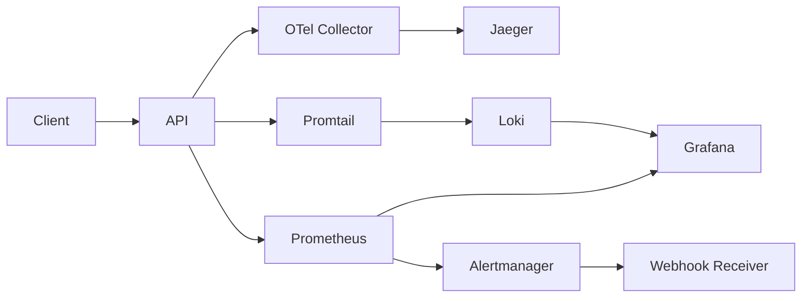

# :telescope: SRE Observability Lab

[](https://github.com/Fernandofarfan/sre-observability-lab/actions/workflows/ci.yml)
[](https://www.python.org/downloads/)
[](https://opensource.org/licenses/MIT)

A production-grade SRE and observability lab demonstrating cloud-native monitoring with OpenTelemetry, Prometheus, Grafana, Jaeger, and chaos engineering. Designed as a professional portfolio piece showcasing deep expertise in site reliability engineering practices.

## What This Project Demonstrates

- **OpenTelemetry Instrumentation:** Automatic and manual distributed tracing with FastAPI, exporting traces to Jaeger via an OTel Collector.
- **Prometheus Metrics:** Custom HTTP metrics (counters, histograms, gauges) exposed via ASGI middleware, scraped by Prometheus. Labels use route templates so cardinality stays bounded.
- **Four Golden Signals Dashboard:** A complete Grafana dashboard visualizing Latency, Traffic, Errors, and Saturation in real-time.
- **SLO/SLI Framework:** Formal definition of availability and latency SLOs with PromQL-based SLIs and Error Budget calculations.
- **Multi-Window Burn-Rate Alerting:** Dual-window error budget burn-rate alerts (14.4x fast / 6x slow) in the style of the Google SRE workbook, not static thresholds.
- **Alert Routing & Delivery:** Alertmanager routes by severity (critical → pager, warning → ticket) to a webhook receiver that logs alerts and exposes `alerts_received_total`, scraped by Prometheus.
- **Infrastructure Alerting:** `up==0` liveness alerts for every monitored target (API, Alertmanager, webhook receiver, Promtail, Loki) so the monitoring pipeline itself is watched.
- **Log Aggregation:** Structured JSON logs from the API shipped via Promtail to Loki, queryable from Grafana.
- **Chaos Engineering:** Runtime fault injection (latency spikes, error storms, gradual degradation) controlled via API endpoints (optional `X-Chaos-Token` guard).
- **Operational Runbooks:** Structured incident response documentation for high error rates and high latency scenarios.

## Architecture



## Quick Start

```bash
git clone https://github.com/Fernandofarfan/sre-observability-lab.git
cd sre-observability-lab
cp .env.example .env
make up
```

## Access Points

| Service | URL | Credentials |
|---------|-----|-------------|
| API Docs | http://localhost:8000/docs | - |
| API Metrics | http://localhost:8000/metrics | - |
| Grafana | http://localhost:3000 | admin / admin |
| Prometheus | http://localhost:9090 | - |
| Jaeger | http://localhost:16686 | - |
| Alertmanager | http://localhost:9093 | - |
| Loki | http://localhost:3100 | - |
| Webhook Receiver | http://localhost:9095/healthz | - |

## Generate Traffic & Observe

```bash
# Terminal 1: Generate normal traffic
make traffic

# Terminal 2: Inject chaos scenario
make chaos-latency
```

## SLOs & Error Budget

| SLO | SLI | Threshold | Error Budget |
|-----|-----|-----------|--------------|
| Availability | Success rate (non-5xx) | 99.5% | 0.5% per 30m window |
| Latency | P95 request duration | 250ms | N/A |

Alerting uses multi-window burn rates (14.4x → critical, 6x → warning); full definition
in [`docs/slo-sli-definition.md`](docs/slo-sli-definition.md).

## Chaos Scenarios

| Scenario | Command | Effect |
|----------|---------|--------|
| `latency-spike` | `make chaos-latency` | 500-2000ms latency for 60s |
| `error-storm` | `make chaos-errors` | 30% error rate for 4m (fires the fast burn-rate alert live) |
| `gradual-degradation` | `make chaos-gradual` | Latency ramps 0-1500ms over 2.5min |
| `full-chaos` | `make chaos-full` | Latency (300-800ms) + errors (20%) for 5m |

## Project Structure

```
sre-observability-lab/
├── app/                    # FastAPI application (routes, services, telemetry)
├── monitoring/             # Prometheus, Grafana, Alertmanager, OTel configs
├── scripts/                # Traffic generator and chaos injection scripts
├── tests/                  # Pytest test suite
├── docs/                   # Architecture, SLO definitions, runbooks
├── .github/workflows/      # CI pipeline (lint, typecheck, test)
├── Dockerfile              # Multi-stage Docker build
├── docker-compose.yml      # Full observability stack
└── Makefile                # Developer workflow commands
```

## Development

```bash
pip install -r requirements-dev.txt
make hooks       # Install pre-commit hooks (ruff + format)
make lint        # Run ruff linter
make typecheck   # Run mypy type checker
make test        # Run pytest test suite with coverage
```

## Tech Stack

| Technology | Version | Purpose |
|------------|---------|---------|
| Python | 3.12 | Application runtime |
| FastAPI | 0.115+ | HTTP framework |
| OpenTelemetry | 1.44+ | Distributed tracing |
| Prometheus | 2.54 | Metrics collection |
| Grafana | 11.2 | Dashboard visualization |
| Jaeger | 1.61.0 | Trace storage & UI |
| Alertmanager | 0.27 | Alert routing |
| Docker Compose | v2 | Container orchestration |

## Author

**Guillermo Fernando Farfan Romero**
Senior Software Engineer & Cloud Solutions Architect

- [Portfolio](https://gfarfan.dev)
- [LinkedIn](https://linkedin.com/in/farfanfernando)
- [GitHub](https://github.com/Fernandofarfan)
- [Credly](https://www.credly.com/users/farfan-fernando)

## License

MIT License - see [LICENSE](LICENSE) for details.
