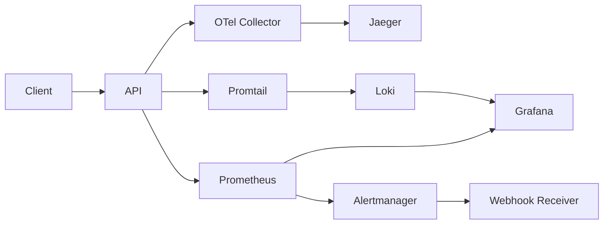

# Architecture Overview

## System Architecture

## Components

| Component | Description |
|-----------|-------------|
| **API (FastAPI)** | Core application exposing business endpoints, instrumented with OpenTelemetry for distributed tracing and Prometheus metrics for monitoring. Runs a **single Uvicorn worker**: the Prometheus client registry and chaos state are per-process, so multiple workers would produce inconsistent scrapes and apply chaos to only a fraction of requests. |
| **OTel Collector** | OpenTelemetry Collector that receives traces via gRPC/HTTP, processes them in batches, and forwards them to Jaeger via OTLP. |
| **Jaeger** | Distributed tracing backend that stores and visualizes traces from the API, enabling latency analysis and request flow inspection. |
| **Prometheus** | Time-series database that scrapes the API plus the observability pipeline itself (webhook receiver, Promtail, Alertmanager, Loki) and evaluates alerting rules: SLO burn rates and infrastructure `up==0` availability. |
| **Grafana** | Visualization platform displaying the Four Golden Signals dashboard, plus log exploration over Loki. |
| **Alertmanager** | Alert routing and deduplication: routes `severity=critical` to the pager receiver and `severity=warning` to the ticket receiver. |
| **Webhook Receiver** | Small FastAPI service that ingests Alertmanager webhooks, emits structured JSON logs for every alert, and exposes `alerts_received_total` so notification delivery is itself observable. |
| **Loki** | Log aggregation backend storing container logs (API and webhook receiver). |
| **Promtail** | Log shipper that discovers lab containers via the Docker socket and pushes their stdout logs to Loki. |

## Data Flow

1. **Request Ingestion:** A client sends an HTTP request to the FastAPI API.
2. **Metrics Recording:** The ASGI `PrometheusMiddleware` intercepts the request, incrementing counters, recording duration in histograms, and tracking in-flight gauges. Labels use route templates (e.g. `/api/v1/orders/{order_id}`), never raw paths, to keep cardinality bounded.
3. **Trace Creation:** OpenTelemetry instrumentation automatically creates spans for each request. Business logic creates child spans (e.g., `order.create`, `payment.process`).
4. **Trace Export:** Spans are batched by the SDK and exported via gRPC to the OTel Collector (`OTEL_TRACES_EXPORTER=none` disables export).
5. **Trace Storage:** The OTel Collector forwards traces to Jaeger via OTLP, where they are indexed and stored.
6. **Metrics Scraping:** Prometheus scrapes the `/metrics` endpoint every 5 seconds, storing time-series data.
7. **Dashboard Rendering:** Grafana queries Prometheus and displays the Golden Signals in real-time dashboards.
8. **Alert Evaluation:** Prometheus evaluates multi-window burn-rate alert rules against collected metrics, firing alerts to Alertmanager when error budget consumption or latency SLOs are breached.
9. **Alert Delivery:** Alertmanager routes firing alerts by severity to the webhook receiver, which logs them as JSON (shipped to Loki) and increments `alerts_received_total`.
10. **Log Aggregation:** Promtail tails container stdout, Loki stores it, and Grafana queries it via the Loki datasource.

## Port Reference

| Port | Service | Protocol | Description |
|------|---------|----------|-------------|
| 8000 | API | HTTP | FastAPI application and Prometheus metrics endpoint |
| 9090 | Prometheus | HTTP | Prometheus web UI and API |
| 3000 | Grafana | HTTP | Grafana dashboard UI (admin/admin) |
| 9093 | Alertmanager | HTTP | Alertmanager web UI |
| 9095 | Webhook Receiver | HTTP | Alertmanager webhook ingestion + `/metrics` |
| 4317 | OTel Collector | gRPC | OpenTelemetry OTLP gRPC receiver |
| 4318 | OTel Collector | HTTP | OpenTelemetry OTLP HTTP receiver |
| 14250 | Jaeger | gRPC | Jaeger collector gRPC endpoint |
| 16686 | Jaeger | HTTP | Jaeger query UI |
| 3100 | Loki | HTTP | Loki API (push/query) |
