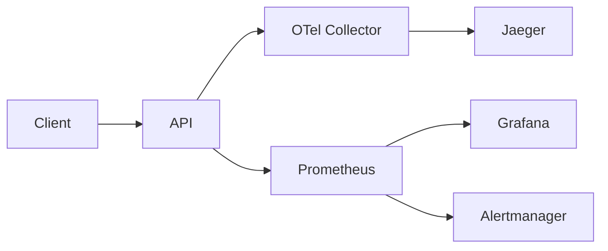

# Architecture Overview

## System Architecture

## Components

| Component | Description |
|-----------|-------------|
| **API (FastAPI)** | Core application exposing business endpoints, instrumented with OpenTelemetry for distributed tracing and Prometheus metrics for monitoring. |
| **OTel Collector** | OpenTelemetry Collector that receives traces via gRPC/HTTP, processes them in batches, and exports to Jaeger for storage and visualization. |
| **Jaeger** | Distributed tracing backend that stores and visualizes traces from the API, enabling latency analysis and request flow inspection. |
| **Prometheus** | Time-series database that scrapes metrics from the API and evaluates alerting rules based on SLO burn rates. |
| **Grafana** | Visualization platform displaying the Four Golden Signals dashboard with real-time metrics from Prometheus. |
| **Alertmanager** | Alert routing and deduplication service that receives firing alerts from Prometheus and manages notification delivery. |

## Data Flow

1. **Request Ingestion:** A client sends an HTTP request to the FastAPI API.
2. **Metrics Recording:** The `PrometheusMiddleware` intercepts the request, incrementing counters, recording duration in histograms, and tracking in-flight gauges.
3. **Trace Creation:** OpenTelemetry instrumentation automatically creates spans for each request. Business logic creates child spans (e.g., `order.create`, `payment.process`).
4. **Trace Export:** Spans are batched by the SDK and exported via gRPC to the OTel Collector.
5. **Trace Storage:** The OTel Collector forwards traces to Jaeger, where they are indexed and stored.
6. **Metrics Scraping:** Prometheus scrapes the `/metrics` endpoint every 5 seconds, storing time-series data.
7. **Dashboard Rendering:** Grafana queries Prometheus and displays the Golden Signals in real-time dashboards.
8. **Alert Evaluation:** Prometheus evaluates alert rules against collected metrics, firing alerts to Alertmanager when thresholds are breached.

## Port Reference

| Port | Service | Protocol | Description |
|------|---------|----------|-------------|
| 8000 | API | HTTP | FastAPI application and Prometheus metrics endpoint |
| 9090 | Prometheus | HTTP | Prometheus web UI and API |
| 3000 | Grafana | HTTP | Grafana dashboard UI (admin/admin) |
| 9093 | Alertmanager | HTTP | Alertmanager web UI |
| 4317 | OTel Collector | gRPC | OpenTelemetry OTLP gRPC receiver |
| 4318 | OTel Collector | HTTP | OpenTelemetry OTLP HTTP receiver |
| 14250 | Jaeger | gRPC | Jaeger collector gRPC endpoint |
| 16686 | Jaeger | HTTP | Jaeger query UI |
